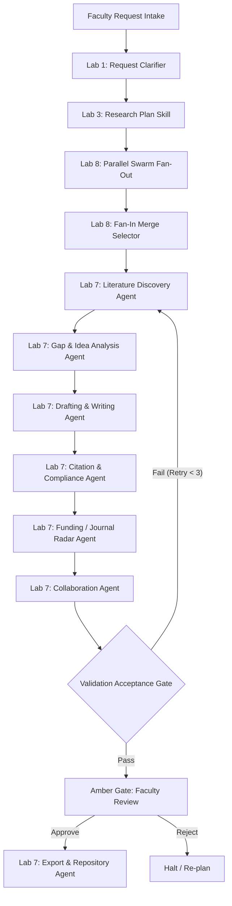

# Agentic AI: Research Assistant Agent (Labs 1 – 8)

This repository contains the complete implementation of the **Research Assistant Agent** up to **Lab 8**, based on Chapter 12 of the *14-Lab Worklet Build Book* and the *Research Assistant Agent Proposal*.

> **Guiding Principle:** Agents draft and flag; a named human (Faculty Examiner) approves. No consequential action (e.g. publication or submission) is taken autonomously.

---

## 🚀 Lab Milestone Summary (Labs 1 – 8)

| Lab | Name & Phase | Capability Implemented | Module / File |
|---|---|---|---|
| **Lab 1** | Agent vs Chatbot (Foundations) | Interactive parameter clarification & editable plan proposal (`clarify -> plan -> revise` loop). | `clarify.py` |
| **Lab 2** | Tool-Using Agent (Foundations) | Replaces LLM memory hallucinations with typed tools querying scholarly datasets. | `search.py` |
| **Lab 3** | Reusable Skills (Foundations) | Schema-typed skills: `ResearchPlanSkill` (blueprint generator) and `FormattingSkill` (IEEE/ACM venue template generator). | `skills.py` |
| **Lab 4** | Memory & Retrieval (Foundations) | Separates short-term session run-state from long-term paper corpus & task history. Supports tag & similarity retrieval. | `memory.py` |
| **Lab 5** | MCP Data Connector (Foundations) | Unified Model Context Protocol (MCP) data surface (`read_paper_corpus`, `read_library`, `read_deadlines`, `read_notes`) with access logging. | `connector.py` |
| **Lab 6** | Audited Runtime (Foundations) | Governed execution controller enforcing step budgets, state checkpointing (`checkpoint.json`), and audit logs. | `runtime.py` |
| **Lab 7** | Agentic Node Graph (Orchestration) | Specialist agent graph with validation acceptance gates, bounded retry back-edges, and hard human review gates. | `specialist_agents.py`, `node_graph.py`, `verify.py` |
| **Lab 8** | Parallel Swarm (Orchestration) | Concurrent fan-out discovery workers using `ThreadPoolExecutor` and fan-in `MergeSelector` aligned to locked plan. | `swarm.py` |

---

## 📁 Repository Structure

```text
AgenticAI-Research-Assistant-Agent/
├── data/
│   ├── corpus.json          # Mock scholarly paper database with DOIs, keywords, abstracts
│   ├── library.json         # Researcher's personal prior publication library
│   ├── deadlines.json       # Mock upcoming journal CFPs and grant funding deadlines
│   └── notes_drafts.json    # Collaborator section assignments & notes
├── clarify.py               # Lab 1: Interactive & automated parameter clarification
├── search.py                # Lab 2: Typed data search tools
├── skills.py                # Lab 3: PlanBlueprint & Formatting skills
├── memory.py                # Lab 4: Short-term run state & retrieval store
├── connector.py             # Lab 5: Governed MCP-style data connector
├── runtime.py               # Lab 6: Governed execution controller, checkpoints & audit logs
├── specialist_agents.py     # Lab 7: Specialist agents (Lit Discovery, Gap, Draft, Citation, Radar, Collab, Export)
├── verify.py                # Lab 2 & 7: Validation Agent & citation grounding gate
├── node_graph.py            # Lab 7: Node Graph pipeline orchestrator with bounded retry
├── swarm.py                 # Lab 8: Parallel Swarm fan-out workers & fan-in selector merge
├── main.py                  # End-to-End Orchestrator (Labs 1 to 8 execution)
├── run_labs.py              # Automated test runner for Labs 1 through 8
└── README.md                # System documentation & execution guide
```

---

## 🛠️ How to Execute

### Prerequisites
- Python 3.8+ (Uses Python standard library; no external `pip` dependencies required).

---

### Option A: Run Automated Verification Suite (Labs 1 to 8)
To run unit tests and acceptance checks for each lab individually:

```bash
python run_labs.py
```

**Expected Output:**
```text
test_lab_1_clarifier_planner_loop ... ok
test_lab_2_typed_tools ... ok
test_lab_3_reusable_skills ... ok
test_lab_4_memory_and_retrieval ... ok
test_lab_5_mcp_connector ... ok
test_lab_6_governed_runtime ... ok
test_lab_7_agentic_node_graph ... ok
test_lab_8_parallel_swarm ... ok
----------------------------------------------------------------------
Ran 8 tests in 0.021s

OK
```

---

### Option B: Interactive Full Pipeline Run
To run the complete interactive pipeline where you enter research parameters and approve the draft at the human gate:

```bash
python main.py
```

**Interactive Walkthrough:**
1. Enter research question topic (e.g., `edge AI hardware porting frameworks`).
2. Specify venue, collaborators, and deadline.
3. Review and approve the proposed plan blueprint.
4. Watch the **Parallel Swarm (Lab 8)** run concurrent discovery across sub-queries.
5. Watch the **Agentic Node Graph (Lab 7)** execute specialist agents in sequence.
6. Review the generated draft at the **Faculty Human Approval Gate** and type `yes` to approve publication.

---

### Option C: Non-Interactive / Unattended Automated Execution
To run the end-to-end pipeline automatically (for benchmarks or CI/CD):

```bash
python main.py --non-interactive --auto-approve
```

---

## 📊 System Architecture & Governance


